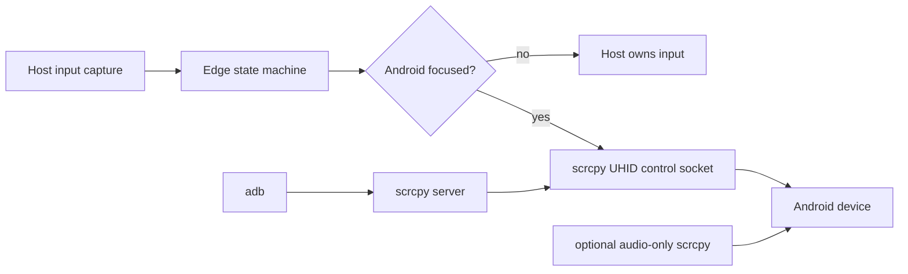

<div id="top">
  <div align="center">
    <h1>android-kvm</h1>
    <strong>USB Android software KVM for keyboard and mouse sharing, backed by scrcpy.</strong>
  </div>
</div>

---

## Contents

- [Overview](#overview)
- [What Works](#what-works)
- [Architecture](#architecture)
- [Quick Start](#quick-start)
- [Configuration](#configuration)
- [Home Manager](#home-manager)
- [Platform Support](#platform-support)
- [Development](#development)

---

## Overview

`android-kvm` turns a USB-connected Android device into an edge-adjacent software KVM target. Push the host pointer through a configured screen edge, and the host starts forwarding keyboard and mouse input to Android through scrcpy's UHID control channel. Move back through the opposite Android edge to release capture and return to the host.

The project intentionally mirrors the lan-mouse interaction model, but keeps Android transport USB-first:

- **Host capture** comes from lan-mouse's `input-capture` / `input-event` crates.
- **Android injection** uses scrcpy's server and control socket directly.
- **Audio** can be kept alive through a separate audio-only scrcpy process.
- **Nix integration** exposes both a package and a Home Manager module.

Because the capture layer uses GPL-3.0-or-later lan-mouse crates, this project is licensed as GPL-3.0-or-later.

## What Works

`android-kvm` is past the initial scaffold stage. It currently provides:

- A Rust CLI with `run`, `check`, and `print-config` subcommands.
- TOML configuration from `${XDG_CONFIG_HOME:-~/.config}/android-kvm/config.toml`.
- lan-mouse-style edge activation with an outward swipe threshold.
- Relative pointer motion forwarding into Android.
- Mouse buttons, scroll, and common keyboard key forwarding through scrcpy UHID.
- Virtual Android pointer bounds tracking so moving back across the Android edge releases capture.
- Direct scrcpy server startup through `adb shell app_process`.
- Optional audio-only scrcpy routing that does not compete with the UHID control socket.
- A Nix package, dev shell, formatter, and Home Manager module exported from the flake.

## Architecture



Runtime ownership is split deliberately:

1. `android-kvm` launches the scrcpy server and owns the control socket for UHID keyboard/mouse events.
2. If audio is enabled, a second scrcpy process is started with `--no-control` so audio can route to the host without taking over input.
3. The edge runtime tracks whether the host or Android is focused, applies activation/release thresholds, and keeps an Android-sized virtual pointer for return-edge detection.

## Quick Start

Enter the development shell:

```bash
nix develop
```

Validate that configured dependencies are available:

```bash
cargo run -- check
```

Print the resolved configuration:

```bash
cargo run -- print-config
```

Preview the `adb` / `scrcpy` commands without starting capture:

```bash
cargo run -- run --dry-run
```

Run the KVM:

```bash
cargo run -- run
```

Override the configured Android placement for one run:

```bash
cargo run -- --android-edge left run
```

### Edge Switching

Set `android-edge` to where the Android device sits relative to the host display: `left`, `right`, `top`, or `bottom`.

For example, with `android-edge = "right"`:

1. Move to the host's right edge.
2. Keep swiping outward by at least `activation-pixels`.
3. Android receives mouse and keyboard input.
4. Move left to Android's left edge to release capture back to the host.

Resting at the host edge is not enough to activate Android focus; the outward swipe threshold is intentional to avoid accidental capture.

## Configuration

By default, `android-kvm` reads:

```text
${XDG_CONFIG_HOME:-~/.config}/android-kvm/config.toml
```

Example:

```toml
android-edge = "right"
activation-pixels = 24
release-pixels = 4
poll-interval-ms = 16
pointer-scale = 1.0
audio-always-on = true
adb-binary = "adb"
android-width = 1080
android-height = 2400
control-port = 0

[scrcpy]
binary = "scrcpy"
serial = "DEVICE_SERIAL"
audio-enabled = true
audio-buffer-ms = 200
extra-args = []
```

| Option | Purpose |
| --- | --- |
| `android-edge` | Host edge used to enter Android focus: `left`, `right`, `top`, or `bottom`. |
| `activation-pixels` | Outward swipe distance required after reaching the host edge. Increase this if capture activates too easily. |
| `release-pixels` | Distance from the Android return edge that releases capture back to the host. |
| `poll-interval-ms` | Capture/runtime poll interval. |
| `pointer-scale` | Multiplier for relative pointer motion before forwarding to Android. |
| `audio-always-on` | Keep the audio-only scrcpy process alive even while host focus is active. |
| `adb-binary` | `adb` executable path or name. |
| `android-width`, `android-height` | Android virtual display bounds for return-edge tracking. If omitted, `android-kvm` queries `adb shell wm size` and falls back to `1080x2400` with a warning. |
| `control-port` | Local TCP port for the scrcpy control tunnel. Keep `0` to let the OS allocate a free port. |
| `scrcpy.binary` | `scrcpy` executable path or name. |
| `scrcpy.serial` | Optional Android device serial for multi-device setups. |
| `scrcpy.audio-enabled` | Start an audio-only scrcpy companion process. |
| `scrcpy.audio-buffer-ms` | Audio buffer passed to scrcpy. |
| `scrcpy.extra-args` | Extra arguments for the audio-only scrcpy process. |

## Home Manager

Import the flake module and configure `programs.android-kvm`:

```nix
{
  inputs,
  pkgs,
  ...
}: {
  imports = [
    inputs.android-kvm.homeManagerModules.android-kvm
  ];

  programs.android-kvm = {
    enable = true;
    package = inputs.android-kvm.packages.${pkgs.stdenv.hostPlatform.system}.default;
    settings = {
      android-edge = "right";
      activation-pixels = 24;
      release-pixels = 4;
      poll-interval-ms = 16;
      pointer-scale = 1.0;
      audio-always-on = true;
      adb-binary = "adb";

      scrcpy = {
        audio-enabled = true;
        audio-buffer-ms = 200;
      };
    };
  };
}
```

The module writes `settings` to `xdg.configFile."android-kvm/config.toml"` and installs the selected package into `home.packages`.

## Platform Support

`android-kvm` asks lan-mouse's `input-capture` crate to pick the first available backend for the current OS instead of hard-coding one capture backend in this project.

| Host OS | Runtime support | Packaging support |
| --- | --- | --- |
| Linux / Wayland | Uses available lan-mouse capture backends such as layer-shell and the input-capture portal. | Nix package/dev shell include Linux X11 libraries needed by lan-mouse's optional X11 backend. |
| Linux / X11 | Uses lan-mouse's X11 capture backend when available. | Nix package/dev shell include `libX11` and `libXtst`. |
| macOS | Uses lan-mouse's macOS capture backend; grant Accessibility/Input Monitoring permissions if capture cannot start. | Exposed through the flake for `x86_64-darwin` and `aarch64-darwin`. |
| Windows | Uses lan-mouse's Windows capture backend when built with Cargo on Windows. | Nix does not package Windows targets; use the Rust/Cargo workflow on Windows. |

Every host still needs `adb`, `scrcpy`, USB access to the Android device, and any OS-specific input-capture permissions.

## Development

Common commands:

```bash
nix develop
cargo test
cargo run -- check
cargo run -- run --dry-run
nix fmt
nix flake check
```

The flake uses the same default Linux/Darwin system set as lan-mouse: `x86_64-linux`, `aarch64-linux`, `x86_64-darwin`, and `aarch64-darwin`.

<div align="right">

[![][back-to-top]](#top)

</div>

[back-to-top]: https://img.shields.io/badge/-BACK_TO_TOP-151515?style=flat-square&color=purple
